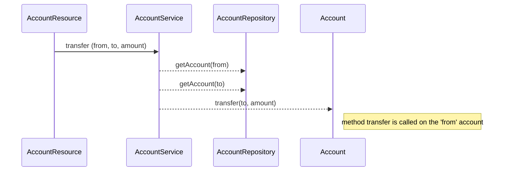

# Banking Service

A simple service to demonstrate how to user Java Lock to make safe transfer between accounts with support for multi-threading

# Transfer Process

## Used Stack

Java 1.8
dropwizard
guice: In this release, dependency injection is used in the test code only

## Build & Run the project
 \> mvn package
 \>cd target 
 \>java -jar banking-1.0-SNAPSHOT.jar server /banking-service.yml

## Swagger URL
http://localhost:8080/swagger